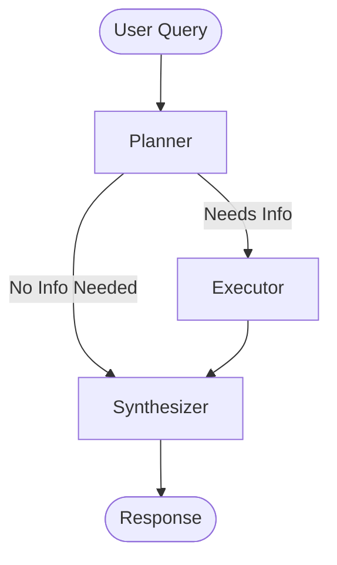

# Agent Design (LangGraph Workflow)

The Virtual Pamudu agent uses a state-machine architecture implemented with **LangGraph**.

## 1. Agent State
Shared memory object passed between nodes:
```python
class AgentState(TypedDict):
    query: str                  # Current user question
    conversation_history: list  # Past messages [{"role": "...", "content": "..."}]
    plan: list[dict]            # Tool calls to execute
    results: list[str]          # Collected information from tools
    final_answer: str           # Synthesized response
    citations: list[dict]       # Structured citations
```

## 2. Global Workflow


## 3. Nodes

### Node 1: Planner
**Goal**: Analyze query + history to decide if external information is needed.
- **Input**: User query, Conversation history.
- **Process**: LLM (GPT-5.1) with system prompt describing all 5 tools.
- **Output**: structured `AgentPlan` (list of tool calls).
- **History Awareness**: Checks history to resolve pronouns ("tell me more about *that*").

### Node 2: Executor
**Goal**: Execute the planned tool calls.
- **Input**: List of tool calls from Planner.
- **Process**: 
    - Iterates through tool calls.
    - Executes Python functions for Brain, Medium, YouTube, GitHub, Email.
    - Captures return values or error messages.
- **Output**: List of result strings appended to state.

### Node 3: Synthesizer
**Goal**: Generate final response with citations.
- **Input**: Original query, Converation history, Collected results.
- **Process**: 
    - Formats context block from results.
    - **Optimization**: If no results (greeting/chit-chat), uses fast LLM path.
    - If results exist, uses structured output LLM to generate answer + citations.
- **Output**: `final_answer` string and `citations` list.

## 4. Tools Capabilities
- **Brain**: Semantic search over resume/personal markdown files.
- **Medium**: List, search, and read articles.
- **YouTube**: List videos, search transcripts, get full transcripts.
- **GitHub**: List/search repos, read READMEs and code files.
- **Email**: Send emails to Pamudu.